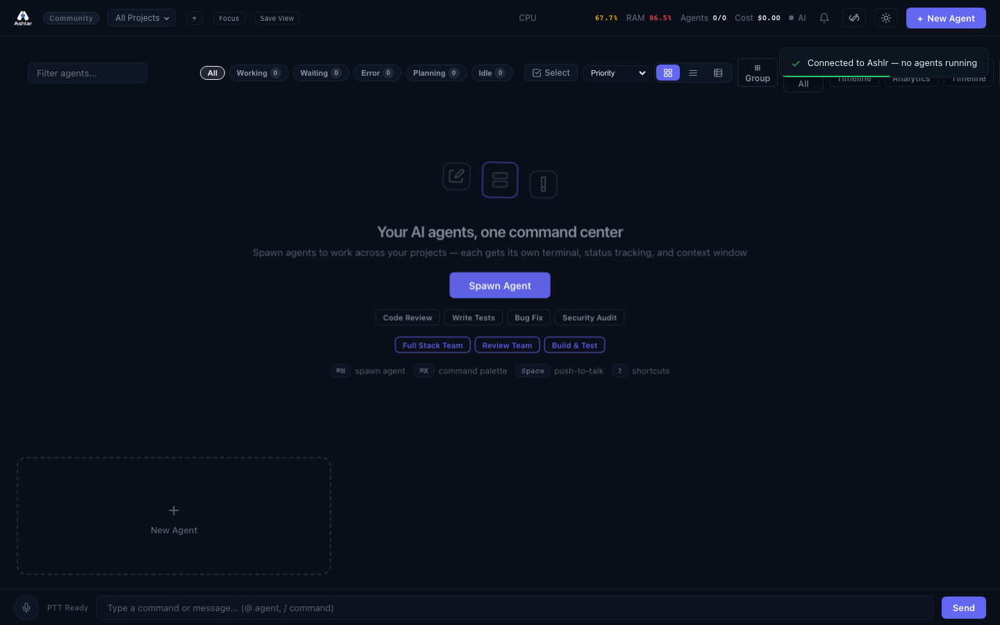

# Ashlr AO

[](https://github.com/Ashlar-inc/ashlar-ao/actions/workflows/ci.yml)
[](https://pypi.org/project/ashlr-ao/)
[](https://python.org)
[](LICENSE)

**Local-first agent orchestration platform.** One developer, many AI coding agents, single command center.

- **Multi-agent orchestration** — spawn, monitor, and coordinate Claude Code, Codex, Aider, and Goose agents from one dashboard
- **Multi-repo projects** — organize agents by project with per-project defaults, git branch tracking, and focus mode
- **Auto-pilot** — auto-restart stalled agents, auto-approve safe patterns, health-based auto-pause
- **Real-time dashboard** — live status cards, terminal output with ANSI colors, keyboard-driven workflow



## Installation

```bash
pip install ashlr-ao
```

### Prerequisites

- **Python 3.11+**
- **tmux** — agent process isolation and output capture
- At least one agent backend CLI:
  - [Claude Code](https://www.npmjs.com/package/@anthropic-ai/claude-code): `npm i -g @anthropic-ai/claude-code`
  - [Codex](https://www.npmjs.com/package/@openai/codex): `npm i -g @openai/codex`

```bash
# Install tmux
brew install tmux        # macOS
sudo apt install tmux    # Linux
```

## Quick Start

```bash
# 1. Install and run
pip install ashlr-ao && ashlr

# 2. Open the dashboard
open http://127.0.0.1:5111

# 3. (Optional) Enable LLM-powered summaries
export XAI_API_KEY="your-key" && ashlr
```

Override the default port with `ASHLR_PORT=8080 ashlr`.

## Features

### Agent Orchestration

Each agent runs in an isolated tmux session. Ashlr captures terminal output every second, detects status via regex pattern matching, and surfaces questions requiring your input.

- Spawn agents with role, task, backend, model, and tool restrictions
- Pause, resume, restart, or kill agents individually or in bulk
- 9 built-in roles: Frontend, Backend, DevOps, Tester, Reviewer, Security, Architect, Docs, General
- Session resume — pick up where a previous agent left off

### Multi-Repo Projects

Organize agents across repositories with project-level defaults.

- Per-project default backend, model, role, and working directory
- Git remote auto-detection and branch tracking per agent
- Filter agents by project, branch, or status
- Focus mode (`Cmd+Shift+F`) — filter dashboard to a single project
- Quick-switch between projects (`Cmd+1-9`)

### Auto-Pilot

Reduce manual intervention with configurable automation.

- **Auto-restart** — automatically restart agents that stall
- **Auto-approve** — approve safe patterns (with hardcoded blocklist for dangerous commands like `rm -rf`, force push, `DROP TABLE`)
- **Auto-pause** — pause agents when health score drops critically
- **Browser notifications** — per-event notification preferences
- Rate-limited: 5 auto-approvals per minute per agent

### Fleet Templates

Save and deploy multi-agent configurations as reusable templates.

- Parameterized tasks with variables: `{branch}`, `{project_name}`, `{date}`
- One-click deploy to any project
- Fleet presets: Full Stack, Review Team, Quality Check

### Real-Time Dashboard

Single HTML file with inline CSS/JS. No build step.

- **Agent cards** — role icon, name, project, git branch badge, live summary, status indicator
- **Deep view** — full terminal output with ANSI colors, activity feed, per-agent scratchpad
- **Command bar** (`Cmd+K`) — `@agent` mentions, `/commands`, natural language via LLM
- **Bulk operations** — select multiple agents, batch actions with variable templates
- **Attention queue** (`Cmd+Shift+A`) — jump to agents needing input
- Push-to-talk voice commands (Web Speech API)

### Intelligence Layer

Optional LLM-powered features via xAI Grok (requires `XAI_API_KEY`).

- 1-line agent status summaries from terminal output
- Natural language command parsing ("spawn 3 agents on auth-service")
- Fleet analysis: detect conflicts, stuck agents, handoff opportunities (every 30s)
- Cross-agent handoff: agents can spawn successors with context
- Circuit breaker: 5 failures triggers 60s cooldown, falls back to regex

### Multi-User Auth

Session-based authentication for team deployments.

- First registered user becomes admin and creates the organization
- Admin invites team members (Pro tier)
- Agent ownership enforcement — only owner or admin can control an agent
- All org members can view all agents (command center purpose)

### Licensing

Open-core model with offline Ed25519-signed JWT licensing.

| | Community (free) | Pro (paid) |
|---|---|---|
| Concurrent agents | 5 | Up to 100 |
| Users | 1 | Up to 50 |
| Intelligence, Workflows, Fleet presets, Multi-user | Gated | Included |
| Core orchestration | Full | Full |

## Keyboard Shortcuts

| Key | Action |
|-----|--------|
| `Cmd+K` | Command palette |
| `Cmd+N` | New agent |
| `Cmd+,` | Settings |
| `Cmd+Shift+S` | Toggle bulk select |
| `Cmd+Shift+A` | Attention queue |
| `Cmd+Shift+F` | Focus mode (single project) |
| `Cmd+/` | Global search |
| `1-9` | Focus agent / select role |
| `A` / `Y` | Approve |
| `R` / `N` | Reject |
| `Escape` | Close overlay / back to grid |
| `Space` (hold) | Push-to-talk |

## Configuration

Config lives at `~/.ashlr/ashlr.yaml` (auto-created on first run).

```yaml
server:
  host: "127.0.0.1"
  port: 5111
  log_level: "INFO"
agents:
  max_concurrent: 16
  default_backend: "claude-code"
  default_role: "general"
  default_working_dir: "~/Projects"
  auto_restart_on_stall: false
  auto_approve_enabled: false
  auto_approve_patterns: []
  auto_pause_on_critical_health: false
  file_lock_enforcement: false
llm:
  enabled: false
  provider: "xai"
  model: "grok-4-1-fast-reasoning"
  api_key_env: "XAI_API_KEY"
```

### Environment Variables

| Variable | Purpose |
|----------|---------|
| `XAI_API_KEY` | LLM-powered summaries, NLU, fleet analysis via xAI Grok |
| `ASHLR_PORT` | Override server port (default: 5111) |
| `ASHLR_HOST` | Override bind host (default: 127.0.0.1) |
| `ASHLR_ALLOWED_ORIGINS` | CORS origin (default: `*`, set to domain for production) |
| `ASHLR_REQUIRE_AUTH` | Force authentication on |

## Docker Deployment

```bash
ASHLR_DOMAIN=ashlr.yourdomain.com docker compose up -d
```

Caddy auto-provisions Let's Encrypt HTTPS. SQLite data persisted via Docker volume.

## Architecture

Modular Python package (`ashlr_ao`) with 24 modules:

| Module | Lines | Purpose |
|--------|-------|---------|
| `server.py` | ~3.9K | Route handlers, `create_app()`, re-exports all submodules |
| `manager.py` | ~1.7K | AgentManager: lifecycle, tmux, workflows, file conflicts |
| `database.py` | ~1.2K | Async SQLite: agents, projects, workflows, users, orgs |
| `background.py` | ~1.1K | 6 supervised background tasks + startup/shutdown |
| `models.py` | ~660 | All dataclasses (Agent, User, Organization, etc.) |
| `intelligence.py` | ~640 | Output parsing, IntelligenceClient, health scoring |
| `websocket.py` | ~400 | WebSocketHub, system metrics |
| `status.py` | ~370 | Status detection, summary extraction |
| `auth.py` | ~350 | Auth middleware, session management |
| `config.py` | ~340 | Config dataclass, YAML load/save, validation |
| `middleware.py` | ~230 | Rate limiter, security headers, CORS, compression |
| `extensions.py` | ~250 | Extension scanner (skills, MCP, plugins) |
| `backends.py` | ~160 | Backend configs (claude-code, codex, aider, goose) |
| `constants.py` | ~160 | Logging, ANSI patterns, secret detection |
| `licensing.py` | ~145 | Ed25519 JWT license validation |
| `roles.py` | ~80 | 9 built-in roles |
| `pty.py` | ~360 | PTY terminal sessions over WebSocket |
| `files.py` | ~430 | File browser REST API (tree, read, write, create, delete) |
| `git.py` | ~420 | Git integration (status, diff, log, stage, commit) |
| `analytics.py` | ~760 | Fleet analytics, collaboration graph, bulk ops |
| `system_endpoints.py` | ~790 | System metrics, health, config, licensing endpoints |
| `workflow_endpoints.py` | ~570 | Workflow CRUD, fleet templates, deployment |
| `dashboard.html` | ~1.5K | HTML shell (CSS/JS in static/) |
| `static/dashboard.js` | ~17K | Dashboard application logic |
| `static/dashboard.css` | ~5.8K | Dashboard styles (dark + light themes) |

Data persisted in SQLite at `~/.ashlr/ashlr.db`.

## API Overview

```
# Agents
POST   /api/agents              Spawn agent
GET    /api/agents              List (filter: ?project_id=, ?branch=, ?status=)
GET    /api/agents/{id}         Details + output
DELETE /api/agents/{id}         Kill
POST   /api/agents/{id}/send    Send message
POST   /api/agents/{id}/pause   Pause (SIGTSTP)
POST   /api/agents/{id}/resume  Resume (SIGCONT)
POST   /api/agents/{id}/restart Restart with same config
POST   /api/agents/bulk         Bulk action

# Projects
GET|POST          /api/projects          List / Create
PUT|DELETE        /api/projects/{id}     Update / Delete
GET               /api/projects/{id}/context   Project context

# Workflows & Templates
GET|POST          /api/workflows         List / Create
POST              /api/workflows/{id}/run      Execute DAG
GET|POST          /api/fleet-templates         List / Create
POST              /api/fleet-templates/{id}/deploy   Deploy to project

# Intelligence
POST   /api/intelligence/command     NLU command parsing
GET    /api/intelligence/insights    Fleet analysis

# Auth
POST   /api/auth/register|login|logout|invite
GET    /api/auth/status|me|team

# System
GET    /api/health|system|config|roles|backends|costs|license/status
```

Full WebSocket protocol at `/ws` for real-time updates.

## Development

```bash
git clone https://github.com/Ashlar-inc/ashlar-ao.git
cd ashlar-ao
pip install -e ".[dev]"
pytest                    # 1911 tests across 31 files
```

See [CONTRIBUTING.md](CONTRIBUTING.md) for guidelines and [CLAUDE.md](CLAUDE.md) for full architecture reference.

## Links

- [Contributing](CONTRIBUTING.md)
- [Security Policy](SECURITY.md)
- [Changelog](CHANGELOG.md)
- [License](LICENSE) (MIT)
